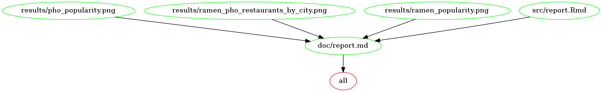

# Ramen vs. Pho

This project investigates the popularity of pho and ramen in major cities across North America.

### Question

Which is more popular: pho or ramen? 

### Hypothesis 

Ramen is more popular than pho in North America. 


### Data Source

The dataset is obtained from Yelp Fusion API for 18 metropolitan cities in North America. 

I used Yelp Fusion's python sample script as a template and modified it to retrieve the top 5 ramen and pho restaurants in each city. The script converts the response into a dataframe and outputs it as a csv file. I also pull the total number of restaurants for each query and store it in a separate csv file. Further detail on how these scripts work can be found [here](src/yelp_fusion/README.md).

These python scripts fetch data for each city individually, which generates a separate csv for each city. To concatenate these csv's into a unified file, run this shell script [**data/concatenate.sh**](data/concatenate.sh). 

Yelp explains their search results algorithm [here](https://www.yelp-support.com/article/How-does-Yelp-decide-which-reviews-to-feature-in-search-results?l=en_US).


### Makefile

The [Makefile](Makefile) contains tasks that clean up intermediate data, run Rscripts, and the knit report Rmarkdown file. 

Running task `make all` will generate a knitted report markdown file. The dependency file structure is defined in this plot:




### Data Analysis Plan 

In this analysis, we compare the number of pho and ramen restaurants in 18 North American cities using a grouped barplot. We also map the frequency of pho and ramen restaurants for each city, to see if there are any patterns in noodle popularity. 


### Results

You can see a report of the analysis [here](doc/report.md).

### Running the analysis in Docker

Clone repo:

```
git clone git@github.com:topspinj/ramen-vs-pho.git
```

You can pull the docker container for this repo here:

```
docker pull jillcates/ramen-vs-pho
```

Start fresh by cleaning up the repo and deleting the intermediate files. You can clean up the raw files too (`make clean_raw`), though this will require you to pull from the Yelp API using your own client tokens. Instructions on how to do this can be found in [**src/yelp_fusion/README.md**](src/yelp_fusion/README.md).

```
# get path using pwd()

docker run --rm -v PATH:/home/ramen-vs-pho jillcates/ramen-vs-pho make -C '/home/ramen-vs-pho' clean_intermeidate
```

Then, you'll need to merge the raw csv files to create a brand new concatenate file that contains data from all of the Yelp API fetches.

```
# get path using pwd()

docker run --rm -it -v PATH:/home/ramen-vs-pho jillcates/ramen-vs-pho make -C 'home/ramen-vs-pho' concatenate_csv
```

The next step is to wrangle the data.

```
# get path using pwd()

docker run --rm -it -v PATH:/home/ramen-vs-pho jillcates/ramen-vs-pho make -C 'home/ramen-vs-pho' wrangle_data
```

It's now time to create the barplots and heatmaps.

```
# get path using pwd()

docker run --rm -v PATH:/home/ramen-vs-pho jillcates/ramen-vs-pho make -C 'home/ramen-vs-pho' barplot

docker run --rm -v PATH:/home/ramen-vs-pho jillcates/ramen-vs-pho make -C 'home/ramen-vs-pho' maps
```

Finally, you can create the report markdown file which reports the results. 

```
# get path using pwd()

docker run --rm -v PATH:/home/ramen-vs-pho jillcates/ramen-vs-pho make -C 'home/ramen-vs-pho' all
```
