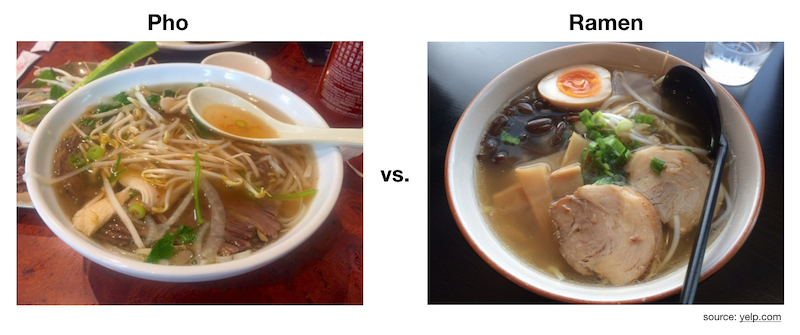
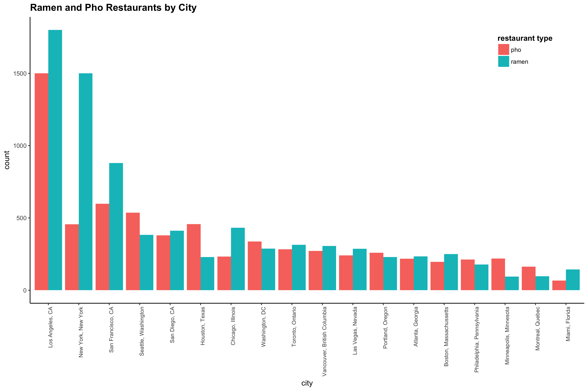
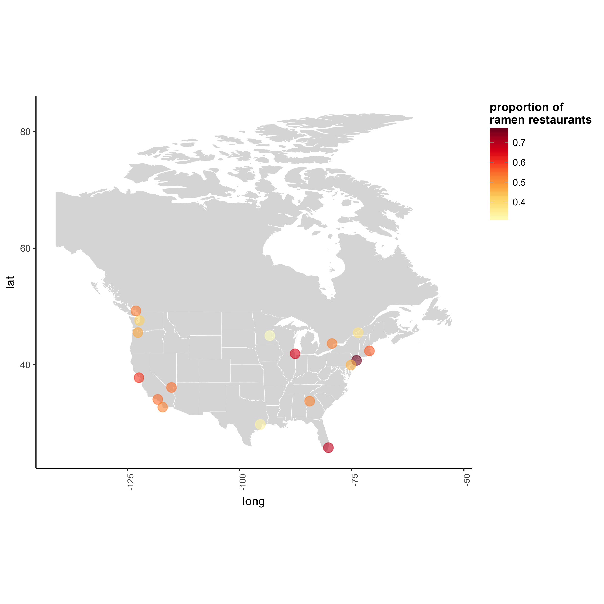

The ramen-vs-pho controversy is an age-old debate that has divided family and friends. 

In this analysis, I delve deeper into this controversial topic to objectively measure which noodle is really the most popular in North America. 

I used the Yelp Fusion API to get pho and ramen restaurant frequencies for 18 cities in North America:

- Toronto, Ontario
- Vancouver, British Columbia
- Montreal, Quebec
- San Francisco, California
- Los Angeles, California,
- San Diego, California
- Seattle, Washington
- New York, New York
- Chicago, Illinois
- Washington, DC
- Miami, Florida
- Minneapolis, Minnesota
- Houston, Texas
- Portland, Oregon
- Philadelpha, Pennsylvania
- Atlanta, Georgia
- Boston, Massachussetts
- Las Vegas, Nevada

These cities were selected based on their population (all metropolitan cities) and their ['foodie' scene](https://www.zagat.com/b/the-26-hottest-food-cities-of-2016). 

### Ramen and Pho Restaurants by North American City

This plot reveals Los Angeles, New York, and San Francisco to have the highest volume of ramen (and pho) restaurants. Ramen is significantly more popular in New York, having more than 3 times more ramen restaurants than pho. 

The three cities with the lowest volume of ramen and pho restaurants are Minneapolis, Montreal, and Miami. 

### Proportion of Pho Restaurants (vs. Ramen) in North America

### Proportion of Ramen Restaurants (vs. Pho) in North America

